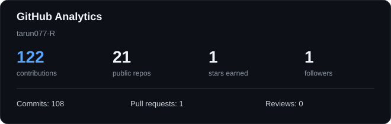
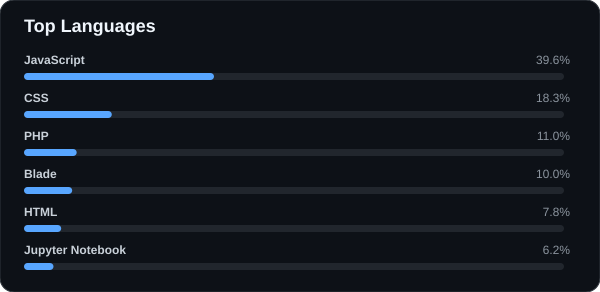
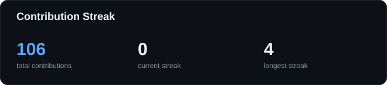
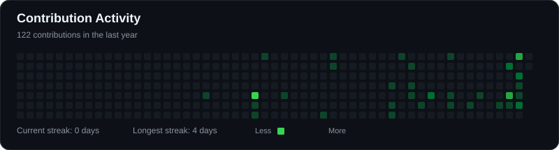

# Hi 👋, I'm Tarun

### MERN Stack Developer | BCA Graduate | Building Modern Full-Stack Web Applications

  
  

---

## 👨‍💻 About Me

I'm a **BCA Graduate and MERN Stack Developer** passionate about building modern, responsive and interactive web applications.

- 💻 Focused on **MERN Stack Development**
- 🌱 Currently learning **TypeScript & GSAP**
- 🎨 Interested in **modern UI, animations and interactive experiences**
- 🚀 Continuously improving my **full-stack development skills**
- 🤝 Open to collaborating on **MERN Stack projects**
- ⚡ I enjoy turning creative ideas into interactive web experiences

---

## 🛠️ Tech Stack

### Frontend

  
  
  
  
  
  
  
  

### Backend & Database

  
  
  
  

### Tools

  
  
  
  

---

## 🚀 Featured Projects

<table>
<tr>
<td width="50%" valign="top">

### 📚 Student E-Library

A web-based library application designed to provide an organized digital learning experience.

`HTML` `CSS` `JavaScript`

</td>
<td width="50%" valign="top">

### 💰 Backend Ledger

A backend-focused project built to practice server-side development, APIs and database integration.

`Node.js` `Express.js` `MongoDB`

</td>
</tr>
</table>

---

## 📊 GitHub Analytics

  

  

---

## 🔥 Contribution Streak

  

---

## 📈 Contribution Activity

  

---

## 🌱 Currently Learning

  
  

  <i>Exploring modern frontend development, animation and interactive user experiences.</i>

---

## 🤝 Connect With Me

  
  
  

---

## ⚡ Fun Fact

  <i>I enjoy turning creative ideas into interactive web experiences.</i>

---

  <b>Thanks for visiting my profile! 🚀</b>

  

